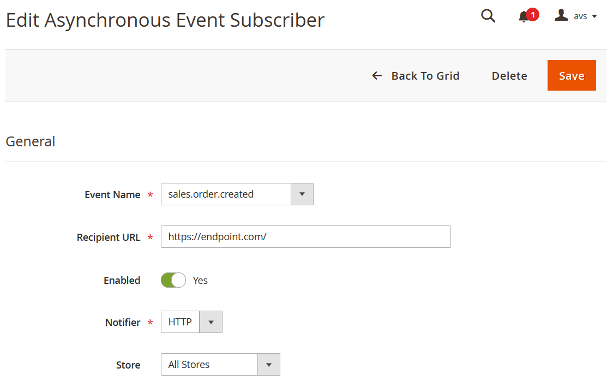

# Mage-OS Asynchronous Events Admin Ui

Add event subscriptions for the Mage-OS Async Events module via an admin form instead of using REST requests.

This module enhances the [Mage-OS Asynchronous Events](https://github.com/mage-os/mageos-async-events/) module.

## Installation

```
composer require mage-os/mageos-async-events-admin-ui
```

If you run into an error like "Could not find a version of package mage-os/mageos-async-events-admin-ui matching your minimum-stability (stable).", run this command instead:
```
composer require mage-os/mageos-async-events-admin-ui @dev
```

Enable and install the module:
```
bin/magento setup:upgrade
```

## Usage

In the Async Events grid (Stores -> Asynchronous Events -> Subscribers) you now have the options to:
* Create new subscriptions
* Edit existing subscriptions
* Delete existing subscriptions


The form for editing or creating subscriptions looks like this:



Please note that this module only supports HTTP subscriptions at the moment.
